# OAuth App based Workload Identity for Droplets

Open Sourced Proof of Concept

- <https://github.com/digitalocean-labs/droplet-oidc-poc>

## Workload Identity

Workload identity is used to reduce the amount of secrets involved in deploying and administrating software systems. Instead of authentication being done based on something a workload knows, for example passwords or API tokens, authentication is done based on what the workload *is*. The heart of workload identity federation is asymmetric cryptography. By leveraging public / private key pairs, tokens can be issued to workloads, such as Droplets, and used for authentication and authorization to APIs exposed by resource servers. Workload identity tokens are exchanged for domain specific access tokens, or grant access to resources directly.

This series showcases how we can use DigitalOcean's OAuth API and fine grained permission scopes to implement and leverage workload identity federation using OpenID Connect (OIDC) protocol tokens. We'll enable secretless access to DigitalOcean hosted databases and Spaces buckets from Droplets and GitHub Actions workflows. Eliminating the need to provision static, long-lived credentials for databases and Spaces buckets for those environments.  

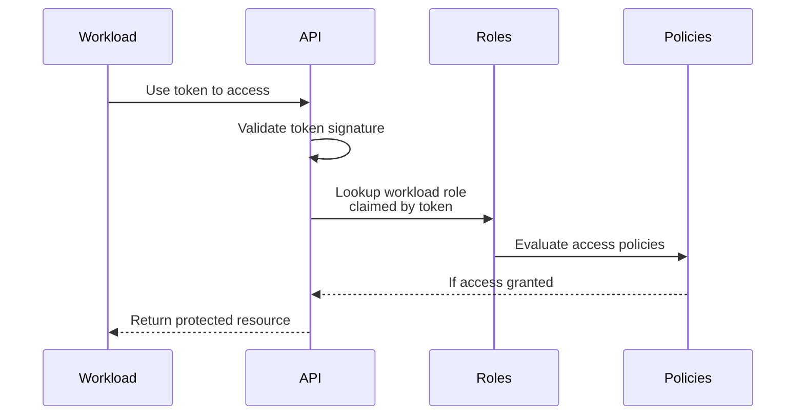

> Workload Identity RBAC

## Security Properties

Authentication based on what the workload *is* requires that the infrastructure orchestrating the workload be able to make verifiable claims about a workload's properties. To do this, the infrastructure responsible for running the workload enables issuance of workload-specific tokens containing these claims. The security of workload identity hinges on proper validation of these tokens per the OIDC protocol specification, the claims defined by each token, and the RBAC configuration used to validate tokens based on their claims.

OIDC tokens are JSON Web Tokens (JWTs). These tokens are cryptographicly signed using a private key. The private key's corresponding public key is made available via the JSON Web Key (JWK) format at a RFC 8615 "well known URI". The URI of the public key is then referenced by a JSON format OpenID Configuration which is hosted at another well known URI.

#### /.well-known/openid-configuration

```json
{
    "issuer": "https://<deployment-name>.ondigitalocean.app",
    "jwks_uri": "https://<deployment-name>.ondigitalocean.app/.well-known/jwks",
    "response_types_supported": ["id_token"],
    "claims_supported": ["sub", "aud", "exp", "iat", "iss"],
    "id_token_signing_alg_values_supported": ["RS256"],
    "scopes_supported": ["openid"],
}
```

#### /.well-known/jwks

```json
{
    "keys": [
        {
            "kty": "RSA",
            "n": "jplR2Q2_hJeA0tqAMqRppJxu16H8i8nrSgX...",
            "e": "AQAB",
            "use": "sig",
            "kid": "g1uTyq-nvRAVGYg6doHZ7LJVuNznJ1QX6OxVebUX6eE"
        }
    ]
}
```

These well known URIs are what make workload identity federation possible. Federation in this context means distinct services are interoperable for the purposes of confirming the identity of a workload by services other than the issuer of the token. Later in our blog post, we'll leverage this interoperability to verify validity of OIDC tokens issued to workflows run by GitHub Actions, in that case, the workflow is the workload. GitHub Action's relevant well known URIs are as follows:

* [https://token.actions.githubusercontent.com/.well-known/openid-configuration](https://token.actions.githubusercontent.com/.well-known/openid-configuration)  
* [https://token.actions.githubusercontent.com/.well-known/jwks](https://token.actions.githubusercontent.com/.well-known/jwks)

The proof of concept we'll be deploying will have the same well known paths, just with a different issuer domain name.

JWTs are issued with a set of "claims". When a token is issued with a certain claim, the issuer is asserting that the token lays claim to some value, and by signing the token using its private key, the issuer is making an attestation to the validity of that claim. Therefore, if we trust a given issuer and an OIDC token passes cryptographic signature verification, we know we can trust the claims within that token. The set of claims we're interested in for our PoC and that our service will issue tokens with are as follows:

```json
{
  "iss": "https://<deployment-name>.ondigitalocean.app",
  "aud": "api://DigitalOcean?actx=f81d4fae-7dec-11d0-a765-00a0c91e6bf6",
  "sub": "actx:f81d4fae-7dec-11d0-a765-00a0c91e6bf6:role:data-readwrite",
  "droplet_id": 514729608
}
```

> Token Claims

The issuer here is within the `"iss"` claim, we append `"/.well-known/openid-configuration"` to find the OpenID Configuration JSON, decode it, and subsequently find the public JSON Web Keys we can use to perform cryptographic signature verification of the token.

Also of critical importance to the security of workload identity federation are the audience (`"aud"`)  and subject (`"sub"`) claims. The audience is used by the resource server to determine if the token is valid for its resources. Our audience is the API we're authenticating to (`"DigitalOcean"`). The subject varies depending on the workload environment we're authenticating from. The subject identifies the workload itself, what is it?

Of most importance to how these function in our PoC, we enable setting the subject on Droplet creation. Creation of a Droplet with certain tags in combination with our RBAC roles will define what that Droplet has access to. We're allowing any team member / role with permission to create a Droplet to set its subject. As such, one must take this into consideration when considering [RBAC definitions and assignments](https://docs.digitalocean.com/platform/teams/roles/custom/). When we access resources from GitHub Actions, we know the answer to "what is it?" based on how the GitHub Actions orchestrator formats the subject: `"org/repo/.github/workflows/name.yml"`.

## Solution Architecture

The goal for our PoC is to allow users to easily provision Droplet access to team resources such as Spaces Keys and Databases, removing the need for out-of-band secret provisioning or hard-coding sensitive values into cloud-init. In our example, we will use GitHub Actions workloads to deploy DigitalOcean Droplets configured with access to a Managed Database and a Spaces bucket without hard-coding any secret token.

Our PoC has the following aspects:

- An OAuth Client Application following the [DigitalOcean OAuth Web Application Flow](https://docs.digitalocean.com/reference/api/oauth/)  
- A policy-based evaluation to determine access control (supporting policy upload)  
- Provisioning and issuing workload identity tokens  
    - .well-known URIs for OIDC token validation  
- Handlers to intercept and wrap routes provided by the DigitalOcean API:  
    - [Create a New Droplet](https://docs.digitalocean.com/reference/api/digitalocean/#tag/Droplets/operation/droplets_create)  
    - [Retrieve an Existing Database Cluster](https://docs.digitalocean.com/reference/api/digitalocean/#tag/Databases/operation/databases_get_cluster)  
    - [Create a New Spaces Access Key](https://docs.digitalocean.com/reference/api/digitalocean/#tag/Spaces-Keys/operation/spacesKey_create)

To tie these aspects together and make them accessible to both our end-users and services such as Droplets and GitHub Actions which will access them, the PoC leverages [caddy](https://github.com/caddyserver/caddy) as a reverse proxy of DigitalOcean's API. We can then write a Caddyfile configuring caddy to expose the OAuth route to the user, passthroughs of the DigitalOcean API to the user and workloads, and our wrappers around routes we'll be modifying to enable workload identity.

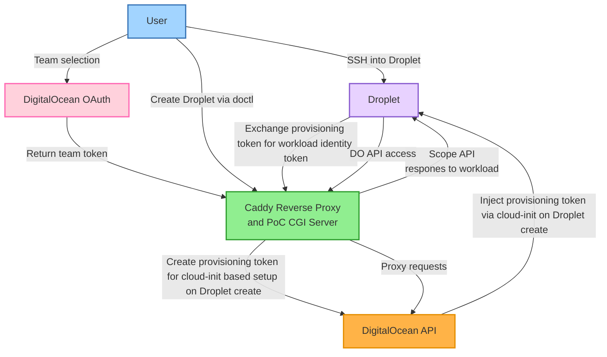

> Solution High Level Flow

Caddy enables us to easily define routes we want to handle and routes we want to wrap. Our app-specific auth code is the [callback.py](https://github.com/digitalocean-labs/droplet-oidc-poc/blob/main/src/workload_identity_oauth_reverse_proxy/cgi/auth/digitalocean/v1/callback.py) file which redirects users when they land at our servers root to the DigitalOcean OAuth team selection and approval page. Once approved, callback.py handles secure storage of the users token for the selected team.

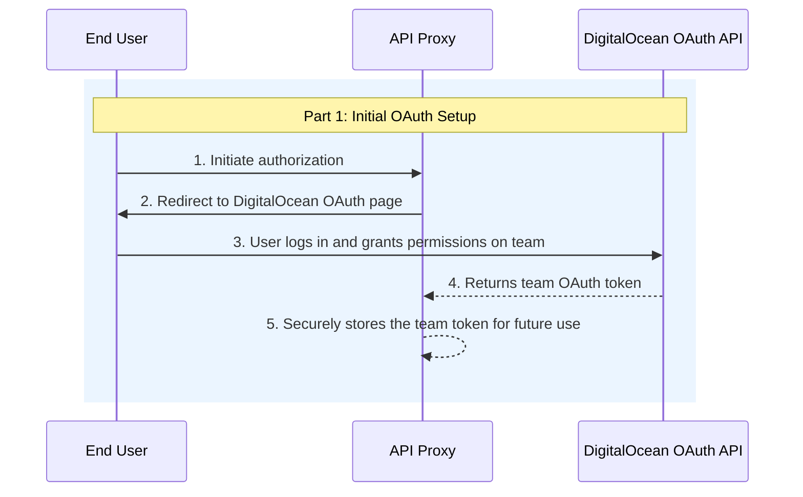

> Part 1: Initial OAuth Web Flow for Team Level Token

When the user issues a Droplet create request, the proxy application intercepts it and calls our wrapper. The wrapper creates a provisioning token which is a JWT with the subject containing a nonce value and the audience containing the team UUID associated with the DigitalOcean Personal Access Token sent to the Droplet create call endpoint. The wrapper then injects the provisioning token into the Droplet via modification of the \`user\_data\` cloud-init field. The modified create request and PAT are then passed through to the upstream API which creates the Droplet.

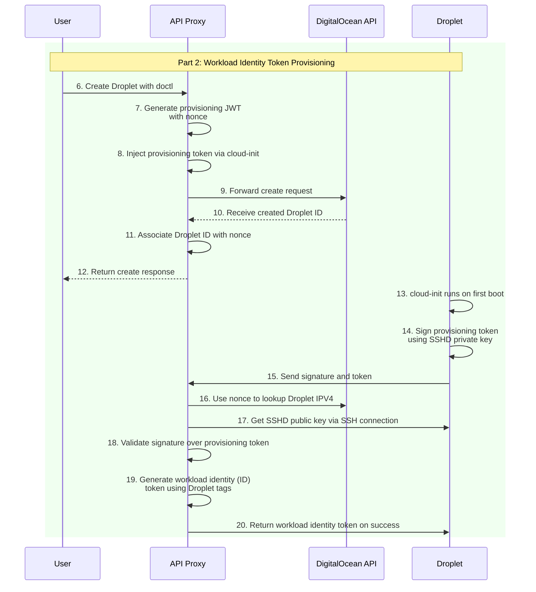

> Part 2: Workload Identity Token Provisioning to Droplet

The application adds the workload identity token to the Droplet after successful completion of signing and validation of a provisioning token done via [cloud-init](https://www.digitalocean.com/community/tutorials/how-to-use-cloud-config-for-your-initial-server-setup). On first boot cloud-init executes the \`user\_data\` which binds the provisioning token to the Droplet by signing it with the Droplet's SSHD private key.

The provisioning token and signature are then exchanged for a workload identity token. Our service looks up the Droplet's IP address using the team OAuth token received from the OAuth flow. It connects to the Droplets listening SSHD port and retrieves its public SSH key to verify the signature over the provisioning token, and upon successful verification it returns the Droplet's workload identity token for storage and later use on the Droplet. The workload identity token is an OIDC protocol compliant RSA JWT with the subject containing information from the Droplet's tags as well as the team UUID within the audience. By including the team UUID in the audience we enable mapping workload identity tokens to the team token provided by the initial web OAuth flow.

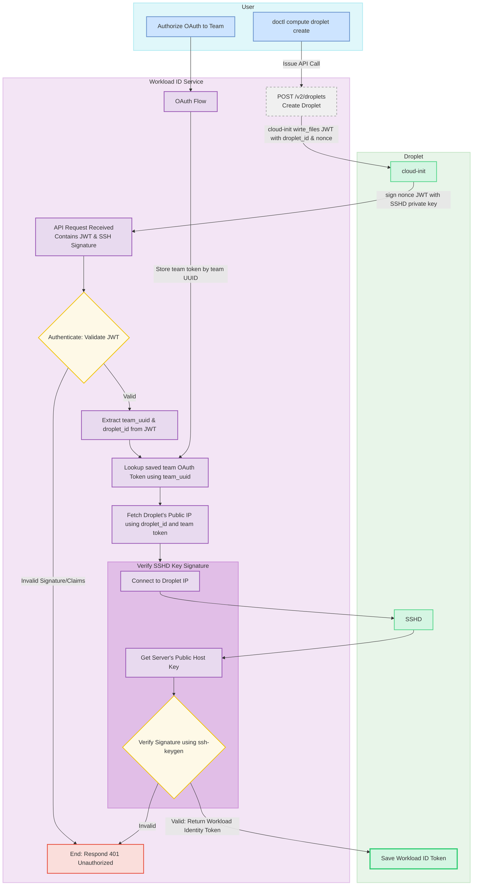

> Workload ID Token Provisioning Flow

From the Droplet, the workload identity token can be sent to our proxy application where wrappers around Spaces Keys creation and Database information retrieval can lookup the associated OAuth token for the team.

Before the proxy makes a request to the upstream API, the associated policy referenced by the workload identity token's subject is used to validate the request data from the workload. The scoped team OAuth token is then used to make the request to the upstream API.

This approach allows us to effectively act as the DigitalOcean API to properly configured clients, such as [doctl](https://github.com/digitalocean/doctl?tab=readme-ov-file#configuring-default-values). Users set the doctl API URL in their doctl config to the fully qualified domain name (FQDN) at which they deployed the API proxy application.

Any doctl commands will then either be intercepted and wrapped by the proxy logic or passed through unaltered. POST requests to Droplet Create and Spaces Keys Create as well as GET requests to Database endpoints are all intercepted and handled by scripts inside the proxy application which wrap requests and responses with the app's custom logic. All other requests are passed through to the upstream DigitalOcean API.

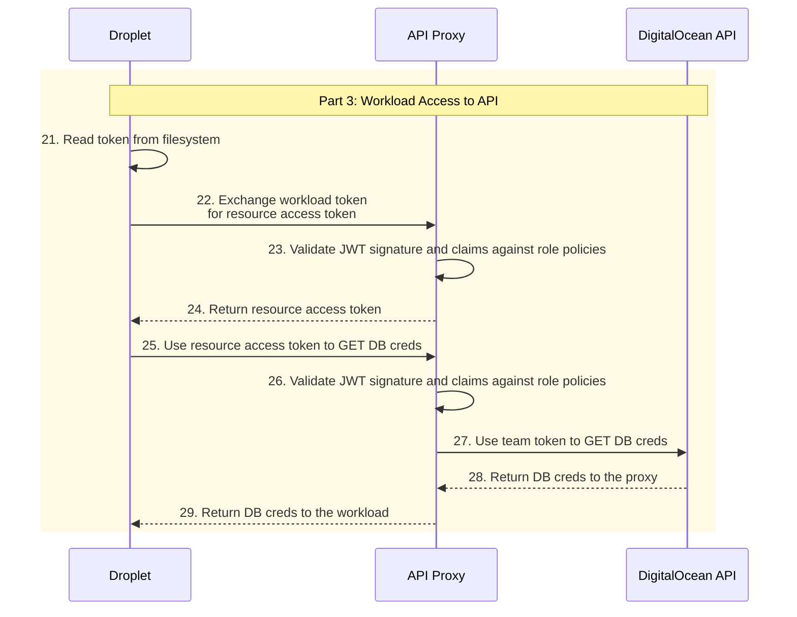

> Part 3: Use of Workload Identity Token by Droplet to Access Resources

## Fine Grained OAuth Scopes

Our [DigitalOcean OAuth Scopes](https://docs.digitalocean.com/reference/api/scopes/) documentation details all fine grained scopes. These scopes are available within custom Role Based Access Control (RBAC), OAuth Apps, and Personal Access Tokens (PATs). When the user is redirected by our root handler \`/\`, they are presented with the DigitalOcean OAuth form which asks them to select which team they would like to grant the specific permissions defined by the scopes. We request only the scopes required to support our wrapped route handlers.

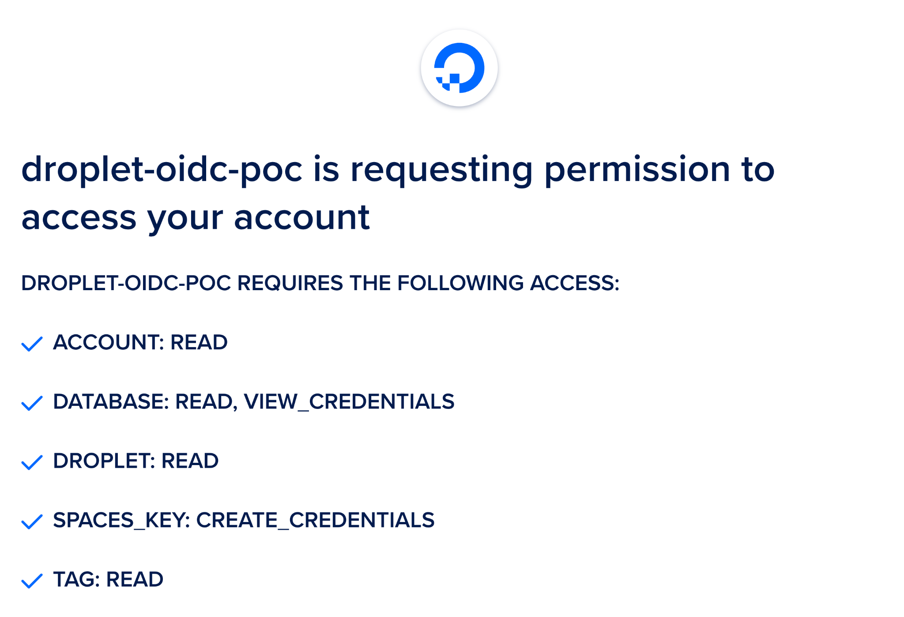

> OAuth Application Scopes Requested

The proxy app's auth route is simply a script which implements the [DigitalOcean OAuth Web Application Flow](https://docs.digitalocean.com/reference/api/oauth/). A user authenticates to a team and the proxy application stores the OAuth team token. When allowed by custom HCL which defines this application's RBAC configuration, the team token is used in place of the workload identity token for requests to the upstream DigitalOcean API.

[](https://cloud.digitalocean.com/apps/new?repo=https://github.com/digitalocean-labs/droplet-oidc-poc/tree/main)

We can safely deploy this application on the open internet accessible to Droplets it spins up due to its reliance on the DigitalOcean OAuth API which underpins the security of the solution. The only outbound connections made are to DigitalOceans API, OAuth API, and Droplets created within the team on first boot. Further details of the security of the solution are found within part 1 of this series on the PoC's architecture.

Click the "Deploy to DigitalOcean" button to deploy the PoC, then find the FQDN of your deployed application as we'll be using it within the next steps.

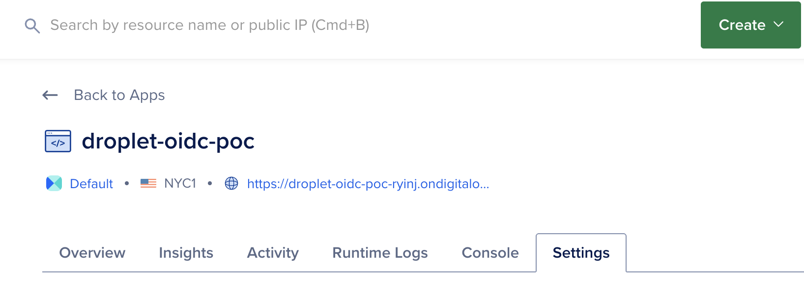

> Deployed Application FQDN

We must now register an OAuth application, copy your deployed application's FQDN and use the following registration form to create the application.

- [https://cloud.digitalocean.com/account/api/applications/new](https://cloud.digitalocean.com/account/api/applications/new)  
- Callback URL: `https://<deployment-name>.ondigitalocean.app/auth/digitalocean/v1/callback`

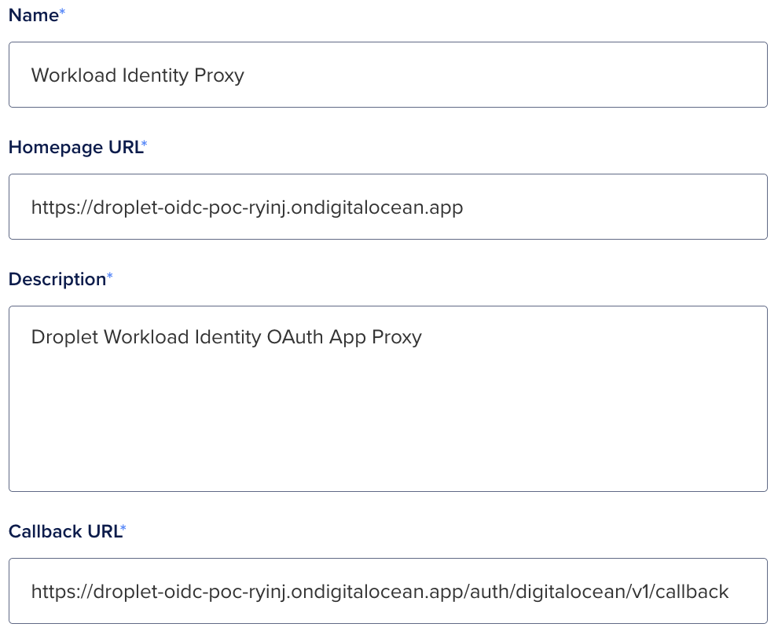

> OAuth Application Registration Form

Now we need to view the OAuth Application's Client ID and Client Secret so that we can set those values in our application's environment variables.

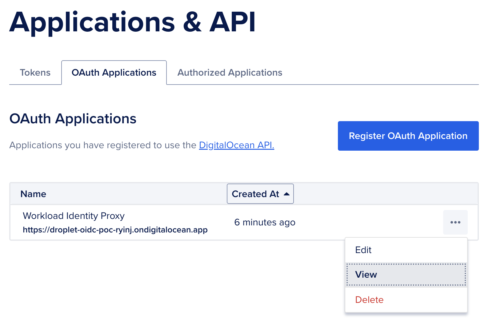

> Click View on OAuth Application

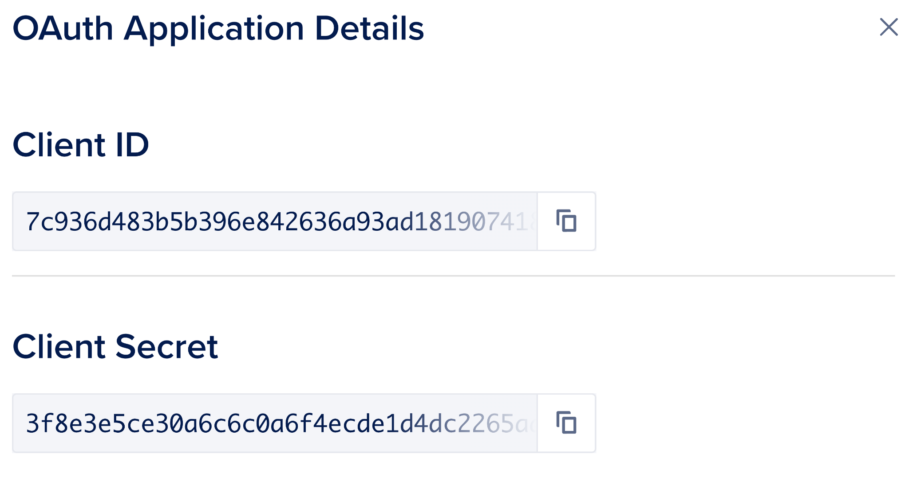

> OAuth Application Client ID and Client Secret

Return to your App Platform application's Settings page, open the App-Level Environment Variables section and populate the `DIGITALOCEAN_OAUTH_CLIENT_ID` and `DIGITALOCEAN_OAUTH_CLIENT_SECRET` environment variables setting them to the values we just viewed. Make sure to check the Encrypt box next to them. Reference [How to Use Environment Variables in App Platform](https://docs.digitalocean.com/products/app-platform/how-to/use-environment-variables/#using-bindable-variables-within-environment-variables) for more details.

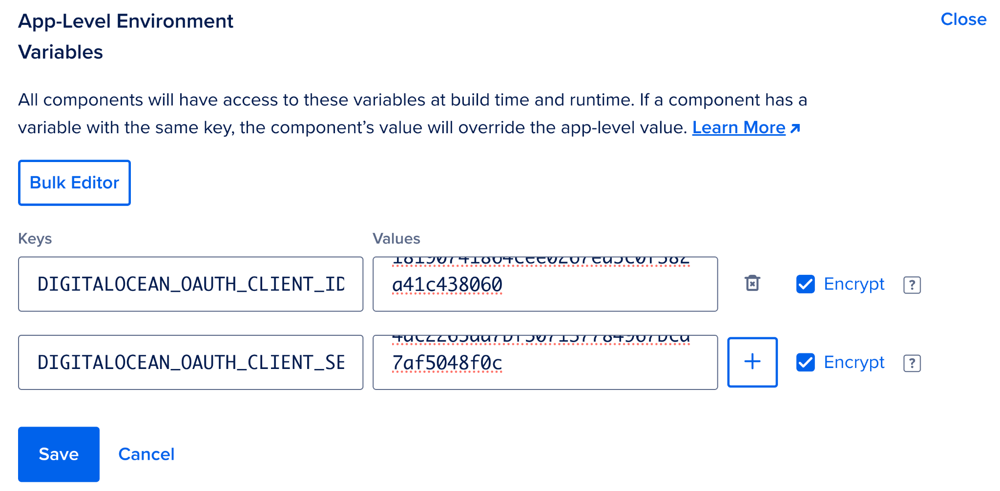

> App Platform Environment Variables

Click Save then ensure the app is re-deployed with the new environment variables by clicking "Force rebuild and deploy".

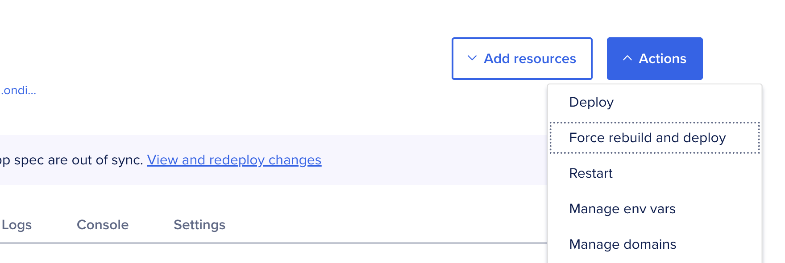

> Click on the "Force rebuild and deploy" Button

Once rebuild and deploy finishes, navigate to your deployed application and complete the OAuth flow to authorize the application for one of your teams, make sure it's the same team you've configured doctl to access using a Personal Access Token. See [How to Install and Configure doctl](https://docs.digitalocean.com/reference/doctl/how-to/install/) for more details.

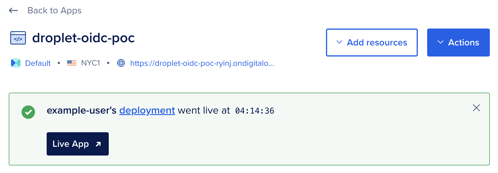

> Click on the "Live App" Button

## Policies and Roles

We need to define policies and roles for our API proxy to evaluate access control. We chose the [HCL](https://github.com/hashicorp/hcl) policy file format as its path-based syntax fits our authorization needs well for this use case.

We'll store these roles and policies in a Git repo.

```bash
mkdir rbac
cd rbac
git init
```

It's best practice to exchange the long lived workload identity for short lived access tokens to specific sets of resources. As such, we'll first create a policy enabling this exchange. The `ex-database-and-spaces-keys-access` policy allows the workload to exchange its workload identity token for a token with the `database-and-spaces-keys-access` role with a short lifetime of 5 minutes (300 seconds). Token exchange is a best practice workload identity access pattern. See [PyPI Docs: Internals and Technical Details](https://docs.pypi.org/trusted-publishers/internals/) for another example of token exchange.

#### policies/ex-database-and-spaces-keys-access.hcl

```hcl
path "/v1/oidc/issue" {
  capabilities = ["create"]
  allowed_parameters = {
    "aud" = "api://DigitalOcean?actx={actx}"
    "sub" = "actx:{actx}:role:database-and-spaces-keys-access"
    "ttl" = 300
  }
}
```

On policy push the Auth Context `{actx}` will be replaced with the UUID of the team token used to push to policy. The PoC ensures that `actx` is always present in the subject and always set to the value from the audience. This ensures that we can reliably switch between authentication contexts via subject validation. We assign the policy to the `ex-database-and-spaces-keys-access` role which we define as follows:

#### droplet-roles/ex-database-and-spaces-keys-access.hcl

```hcl
role "ex-database-and-spaces-keys-access" {
  aud      = "api://DigitalOcean?actx={actx}"
  sub      = "actx:{actx}:role:ex-database-and-spaces-keys-access"
  policies = ["ex-database-and-spaces-keys-access"]
}
```

[The PoC](https://github.com/digitalocean-labs/droplet-oidc-poc) supports reading information about Databases and creation of Spaces keys.

A policy which enables Database credential read can be written as follows.

#### policies/database-credential-read.hcl

```hcl
path "/v2/databases/9cc10173-e9ea-4176-9dbc-a4cee4c4ff30" {
  # Enable read of a single database by UUID.
  capabilities = ["read"]
}

path "/v2/databases" {
  # Enable read of databases tagged with given tag name.
  # ? is used for query parameters.
  capabilities = ["read"]
  allowed_parameters = {
    "?" = {
      "tag_name" = "my-tag"
    }
  }
}
```

A policy which enables Spaces key creation can be written as follows.

#### policies/spaces-keys.hcl

```hcl
path "/v2/spaces/keys" {
  # Enable creation of Spaces keys to access a named bucket.
  # Allowed parameters not in the top level ? key are treated
  # as POST body keys whose values must match hcl defined values.
  capabilities = ["create"]
  allowed_parameters = {
    "name" = "bucket-111-read-token-*"
    "grants" = [
      {
        "bucket" = "111"
        "permission" = "read"
      }
    ]
  }
}

path "/v2/spaces/keys/*" {
  # Enable deletion of Spaces keys.
  capabilities = ["delete"]
}
```

We assign the policies to the `database-and-spaces-keys-access` role, which we define as follows:

#### roles/database-and-spaces-keys-access.hcl

```hcl
role "database-and-spaces-keys-access" {
  aud      = "api://DigitalOcean?actx={actx}"
  sub      = "actx:{actx}:role:database-and-spaces-keys-access"
  policies = ["database-credential-read", "spaces-keys"]
}
```

Finally, we commit and push the configuration to the proxy app. Authentication is done via a custom git credential helper script which uses our doctl token to help the API server know what team we're configuring roles and policies for. The DigitalOcean API token used must have permission to create Droplets within the team, as this PoC has a tight coupling of Droplet creation and usage of defined roles and policies.

```bash
# Define the FQDN of your deployed API proxy
export THIS_ENDPOINT="https://<deployment-name>.ondigitalocean.app"

mkdir -p "${HOME}/.local/scripts/"
tee "${HOME}/.local/scripts/git-credential-rbac-digitalocean.sh" <<'EOF'
#!/usr/bin/env bash

TOKEN=$(doctl auth token)

while IFS='=' read -r key value; do
  if [[ -n "$key" && -n "$value" ]]; then
    if [[ "$key" == "protocol" || "$key" == "host" ]]; then
      echo "$key=$value"
    fi
  fi
done

echo "username=token"
# https://git-scm.com/docs/git-credential documents how this style of
# script works, stdin / stdout is used for communication to / from git
# and the bash process executing this script. Since we always use the
# doctl local PAT for authentication to this PoC deployment, we don't need
# to add custom logic around if this host or if this protocol, we always
# use the token for the deployed FQDN (git config --global
# credential."${THIS_ENDPOINT}".helper)
echo "password=${TOKEN}"
EOF

chmod 700 "${HOME}/.local/scripts/git-credential-rbac-digitalocean.sh"
git init
git config --global credential."${THIS_ENDPOINT}".helper \
  '!'"${HOME}/.local/scripts/git-credential-rbac-digitalocean.sh"
git branch -M main
git add .
git commit -sm "feat: configure access from droplet"
git remote add deploy "${THIS_ENDPOINT}"
git push -u deploy main

# View deployed config
git fetch --all && git show deploy/schema:rbac.json | jq
```

Now that we've deployed and configured our [OAuth application](https://github.com/digitalocean-labs/droplet-oidc-poc), we can create a new Droplet which will receive a workload identity token. We'll exchange our token for Database connection credentials as well as a Spaces bucket access key. Finally, we'll add a role and policy to enable the same exchange to happen from a GitHub Actions workflow file within a repository of our choosing.

## Droplet Creation and Token Provisioning

We can create a new Droplet which will receive a workload identity token by calling `doctl compute droplet create` with the API URL set to our deployed application. The OIDC subject will be prefixed with the Auth Context automatically. In the following example the Droplet will be issued a token with the subject value of:

    actx:f81d4fae-7dxec-11d0-a765-00a0c91e6bf6:role:ex-droplet-readwrite

Where `f81d4fae-7dxec-11d0-a765-00a0c91e6bf6` is an example team UUID. The actual value will be the UUID of the team which the Droplet was created under.

**You may want to add `--ssh-keys <some-key-id-or-hash>` to this command to enable ssh to the Droplet from your terminal. If you do not add that you'll need to use the web terminal via <https://cloud.digitalocean.com> to access the Droplet's console.**

```bash
doctl \
    --api-url "https://<deployment-name>.ondigitalocean.app" \
    compute droplet create \
    --region sfo2 \
    --size s-1vcpu-1gb \
    --image ubuntu-24-04-x64 \
    --tag-names "oidc-sub:role:ex-database-and-spaces-keys-access" \
    test-droplet-0001
```

Creation of Droplet with read-write role

## Token Usage from Droplet

From the Droplet, we grab the workload identity token which was provisioned by our server and can now hit API paths on the proxy as specified by our Droplet role and policy.

We grab relevant values from files created by our provisioning flow, the URL of our PoC, the team UUID, and the workload identity token.

```bash
URL=$(cat /root/secrets/digitalocean.com/serviceaccount/base_url)
TEAM_UUID=$(cat /root/secrets/digitalocean.com/serviceaccount/team_uuid)
ID_TOKEN=$(cat /root/secrets/digitalocean.com/serviceaccount/token)
```

We grab relevant values from files created by our provisioning flow, the URL of our PoC, the team UUID, and the workload identity token. Per our `ex-droplet-readwrite` role and policy we then exchange the workload identity token for a \`data-readwrite\` role token.

```bash
SUBJECT="actx:${TEAM_UUID}:role:database-and-spaces-keys-access"

TOKEN=$(curl -sf \
  -H "Authorization: Bearer ${ID_TOKEN}" \
  -d@<(jq -n -c \
    --arg aud "api://DigitalOcean?actx=${TEAM_UUID}" \
    --arg sub "${SUBJECT}" \
    --arg ttl 300 \
    '{aud: $aud, sub: $sub, ttl: ($ttl | fromjson)}') \
  "${URL}/v1/oidc/issue" \
  | jq -r .token)
```

We can then use the `data-readwrite` role token to access database connection strings.

```bash
DATABASE_UUID="9cc10173-e9ea-4176-9dbc-a4cee4c4ff30"
curl -sf \
  -H "Authorization: Bearer ${TOKEN}" \
  "${URL}/v2/databases/${DATABASE_UUID}" \
  | jq -r .database.connection.uri

TAG_NAME="my-tag"
curl -sf \
  -H "Authorization: Bearer ${TOKEN}" \
  "${URL}/v2/databases?tag_name=${TAG_NAME}" \
  | jq -r .databases[].connection.uri
```

We can also use it to create new Spaces access keys.

```bash
curl -sf \
  -X POST \
  -H "Authorization: Bearer ${TOKEN}" \
  -H "Content-Type: application/json" \
  -d@<(jq -n -c \
    --arg name "bucket-111-read-token-droplet" \
    --arg bucket "111" \
    --arg perm "read" \
    '{name: $name, grants: [{"bucket": $bucket, "permission": $perm}]}') \
  "${URL}/v2/spaces/keys" \
  | jq
```

If we provide parameters to the token creation which are invalid to the relevant policies we've defined API calls will be unsuccessful. The following is an example of an unsuccessful call per our `data-readwrite` policy. It attempts to create a `read` token for bucket `222`, which is not listed in our defined allowlist parameters.

```bash
curl -vf \
  -X POST \
  -H "Authorization: Bearer ${TOKEN}" \
  -H "Content-Type: application/json" \
  -d@<(jq -n -c \
    --arg name "bucket-111-read-token-droplet" \
    --arg bucket "222" \
    --arg perm "read" \
    '{name: $name, grants: [{"bucket": $bucket, "permission": $perm}]}') \
  "${URL}/v2/spaces/keys" \
  | jq
```

## GitHub Actions Usage

For the sake of example we hypothesize that a workload might need to run database migrations during a release process. As such, we need the release workflow to have access to the database URI.

We define a policy which allows for creation of a data-readwrite role token.

#### policies/ex-gha-readwrite.hcl

```hcl
path "/v1/oidc/issue" {
  capabilities = ["create"]
  allowed_parameters = {
    "aud" = "api://DigitalOcean?actx={actx}"
    "sub" = "actx:{actx}:role:database-and-spaces-keys-access"
    "ttl" = 300
  }
}
```

And we assign the policy to a role for OIDC tokens created for a given GitHub Actions workflow.

#### gha-roles/ex-gha-readwrite.hcl

```hcl
role "ex-gha-readwrite" {
  iss              = "https://token.actions.githubusercontent.com"
  aud              = "api://DigitalOcean?actx={actx}"
  sub              = "repo:org/repo:ref:refs/heads/main"
  policies         = ["ex-gha-readwrite"]
  job_workflow_ref = "org/repo/.github/workflows/do-wid.yml@refs/heads/main"
}
```

Add and push the file to apply the new policy.

```bash
git add .
git commit -sm "feat: configure access from gha"
git push
```

Now create a GitHub Actions workflow in your repository which uses the DigitalOcean Workload ID API proxy. In the following example we define the DigitalOcean team UUID we're authenticating to in the OIDC token's audience. This definition enables our API proxy to lookup RBAC associated with our team, and unlock the team token for use with the upstream DigitalOcean API, provided requests pass the data-readwrite policy validation.

#### .github/workflows/do-wid.yml

```yaml
name: DO Workload API

on:
  push:
    branches:
      - main
    paths:
      - '.github/workflows/do-wid.yml'

jobs:
  migrations:
    runs-on: ubuntu-latest
    permissions:
      id-token: write
    env:
      DO_BASE_URL: 'https://<deployment-name>.ondigitalocean.app'
      DO_TEAM_UUID: 'f81d4fae-7dec-11d0-a765-00a0c91e6bf6'
      DO_DATABASE_UUID: '9cc10173-e9ea-4176-9dbc-a4cee4c4ff30'
    steps:
      - name: Get GitHub OIDC Token
        id: token
        uses: actions/github-script@v6
        with:
          script: |
            const token = await core.getIDToken(
              'api://DigitalOcean?actx=${{ env.DO_TEAM_UUID }}'
            );
            core.setOutput('oidc', token);

      - name: Get data-readwrite token
        id: data-readwrite
        env:
          SUBJECT: "actx:${{ env.DO_TEAM_UUID }}:role:database-and-spaces-keys-access"
          GH_OIDC_TOKEN: ${{ steps.token.outputs.oidc }}
        run: |
          set -eo pipefail
          TOKEN=$(curl -sf \
            -H "Authorization: Bearer ${GH_OIDC_TOKEN}" \
            -d@<(jq -n -c \
              --arg aud "api://DigitalOcean?actx=${DO_TEAM_UUID}" \
              --arg sub "${SUBJECT}" \
              --arg ttl 300 \
              '{aud: $aud, sub: $sub, ttl: ($ttl | fromjson)}') \
            "${DO_BASE_URL}/v1/oidc/issue" \
            | jq -r .token)
          echo "::add-mask::${TOKEN}"
          echo "oidc=${TOKEN}" >> "${GITHUB_OUTPUT}"

      - name: Get database connection details
        id: db
        env:
          DO_OIDC_TOKEN: ${{ steps.data-readwrite.outputs.oidc }}
        run: |
          set -eo pipefail
          DB_URI=$(curl -sfH "Authorization: Bearer ${DO_OIDC_TOKEN}" \
            "${DO_BASE_URL}/v2/databases/${DO_DATABASE_UUID}" \
            | jq -r .database.connection.uri)
          echo "::add-mask::${DB_URI}"
          echo "uri=${DB_URI}" >> "${GITHUB_OUTPUT}"
```

## Further Applications

Congratulations\! You've successfully deployed, configured, and used the [workload identity reverse proxy PoC](https://github.com/digitalocean-labs/droplet-oidc-poc) to enable Droplets and GitHub Actions to access DigitalOcean API resources. However, the secretless fun doesn't stop there\!

In the age of dynamic workflows (aka AI Agents) we don't always want to give out access tokens which allow destructive operations or write operations. Unfortunately, that fine grained control may not always be available to us. The MCP specification has OAuth support, however, that's only useful to us within end-user driven environments. The workload identity reverse proxy we've covered in this series is an interesting pattern to explore within the headless AI Agent space. When deployed, it provides OAuth login capabilities and RBAC configuration to centrally manage usage of access tokens and forwarding of requests to upstream APIs using API specific tokens.

[GitHub Copilot coding agent](https://docs.github.com/en/copilot/how-tos/use-copilot-agents/coding-agent/extend-coding-agent-with-mcp) is an example of an environment which could benefit from the use of a workload identity reverse proxy. Instead of configuring manually provisioned API keys for MCP servers, the reverse proxy FQDN is used in place of those services APIs. Token exchange then happens similar to the GitHub Copilot coding agent Azure MCP configuration example for each upstream used. The workload's OIDC token is exchanged for the scoped token which we've been using to make requests to specific paths protected by the reverse proxy. This scoped token, now dynamically allocated, is used in place of manually provisioned API tokens.

Headless AI agents are thereby enabled to operate autonomously within the bounds of the policies associated with the roles of the exchanged token. This enables enforcement of the principle of least privilege across upstream APIs and with many MCP servers which lack native support for such fine grained controls or support for workload identity authentication and authorization.

One way we could maximize the usefulness of this pattern is to apply it to headless AI agent swarms. We could combine prior work such as [Seamless LangChain Integration with DigitalOcean Gradient (TM) AI Platform](https://www.digitalocean.com/blog/digitalocean-gradient-ai-platform-langchain-integration) and [LangGraph Multi-Agent Swarm](https://github.com/langchain-ai/langgraph-swarm-py) to create a dynamic swarm of agents backed by elastic heterogeneous compute (DigitalOcean Droplets and GitHub Actions). A workload identity reverse proxy could also perform resource management at the role context, scoping resource usage / spend, disallowing requests or reaping resources when a role's context has exceeded limits.

Communications between agents within the same trust boundary could easily be done via scoped resources within their team, such as Databases and Spaces buckets.

Agents or agent swarms within different trust boundaries (such as VPCs or across organizational boundaries) may wish to communicate over digital trust infrastructure such as the Authenticated Transfer Protocol (aka [ATProto](https://atproto.com/)).

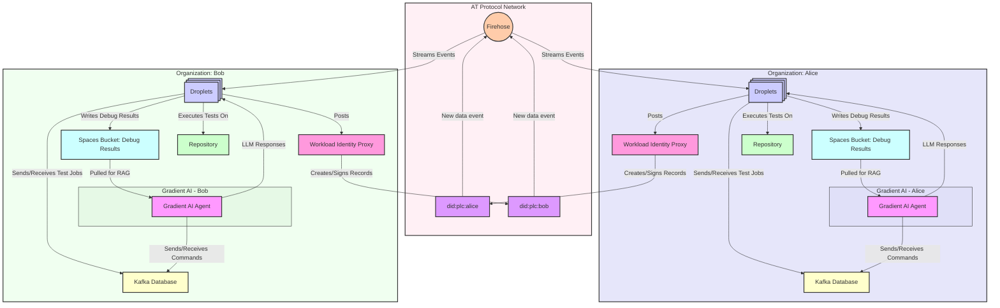

> Cross Organization Agent Collaboration using ATProto

To enable such a flow we'd provision DID:PLC's for our distinct trust boundaries, and enable token exchange within their roles and policies.

#### droplet-roles/ex-database-and-spaces-keys-access.hcl

```diff
 role "ex-database-and-spaces-keys-access" {
   aud      = "api://DigitalOcean?actx={actx}"
   sub      = "actx:{actx}:role:ex-database-and-spaces-keys-access"
+  policies = ["ex-database-and-spaces-keys-access", "ex-atproto"]
 }
```

**TODO Make sure to replace the example `did:plc` in the following policy with your actual one!**

#### policies/ex-atproto.hcl

```hcl
path "/v1/oidc/issue" {
  capabilities = ["create"]
  allowed_parameters = {
    # TODO Make sure to replace this with your actual did:plc
    "aud" = "api://ATProto?actx=did:plc:ewvi7nxzyoun6zhxrhs64oiz"
    "sub" = "actx:{actx}:role:atproto-write"
    "ttl" = 300
  }
}
```

### ATProto Login and RBAC Configuration

We then perform the OAuth web flow for each DID:PLC and configure roles and policies appropriately. As we're switching from the DigitalOcean API context to the ATProto API context it's important we ensure the role which allows issuance of ATProto access tokens enforces that they must only be granted to tokens from our team's UUID. We do this by ensuring the source auth context is present in the allowed subject `actx:f81d4fae-7dxec-11d0-a765-00a0c91e6bf6`.

<!-- BLUESKY_LOGIN -->

<!-- BLUESKY_POLICY_TOKEN -->

**First make sure you're reading this from your deployed application** and install `keyring`

```bash
mkdir did-rbac
cd did-rbac
python -m venv .venv
. .venv/bin/activate
python -m pip install -U keyring keyrings.alt pyjwt
```

The copy the above token and paste it into `keyring set ...`

```bash
python -m keyring set oidc-reverse-proxy rbac.did.token
```

We then create another RBAC repo (for this `did:plc` rather than the DO account earlier).

```bash
# Ensure we've defined the FQDN of your deployed API proxy
export THIS_ENDPOINT="https://<deployment-name>.ondigitalocean.app"
export DID_PLC="$(python -c 'import sys, jwt, json; print(json.dumps(jwt.decode(sys.argv[-1], options={"verify_signature": False})))' $(python -m keyring get oidc-reverse-proxy rbac.did.token) | jq -r .did_plc)"

mkdir -p "${HOME}/.local/scripts/"

tee "${HOME}/.local/scripts/git-credential-rbac-atproto.sh" <<'EOF'
#!/usr/bin/env bash
TOKEN="$(python -m keyring get oidc-reverse-proxy rbac.did.token)"

while IFS='=' read -r key value; do
  if [[ -n "$key" && -n "$value" ]]; then
    if [[ "$key" == "protocol" || "$key" == "host" ]]; then
      echo "$key=$value"
    fi
  fi
done

echo "username=token"
echo "password=${TOKEN}"
EOF

chmod 755 "${HOME}/.local/scripts/git-credential-rbac-atproto.sh"

git init
git config --global --unset credential."${THIS_ENDPOINT}".helper
git config --global credential."${THIS_ENDPOINT}/_rbac/DigitalOcean/".helper \
  '!'"${HOME}/.local/scripts/git-credential-rbac-digitalocean.sh"
git config --global credential."${THIS_ENDPOINT}/_rbac/ATProto/".helper \
  '!'"${HOME}/.local/scripts/git-credential-rbac-atproto.sh"
git branch -M main
echo .venv/ >> .gitignore
git add .
git commit -sm "feat: setup credential helper"
git remote add deploy "${THIS_ENDPOINT}/_rbac/ATProto/${DID_PLC}"
git push -u deploy main
```

**Be sure to replace the example team UUID in the following file with your actual team UUID**

#### roles/atproto-write.hcl

```hcl
role "atproto-write" {
  aud      = "api://ATProto?actx={actx}"
  # TODO Replace f81d4fae-7dec-11d0-a765-00a0c91e6bf6 with your actual team UUID!
  # doctl account get -o json | jq -r .team.uuid
  sub      = "actx:f81d4fae-7dec-11d0-a765-00a0c91e6bf6:role:atproto-write"
  policies = ["atproto-write"]
}
```

This does the replacement using `doctl` and `sed`.

```bash
sed -i "s/f81d4fae-7dec-11d0-a765-00a0c91e6bf6/$(doctl account get -o json | jq -r .team.uuid)/g" roles/atproto-write.hcl
```

#### policies/atproto-write.hcl

```hcl
path "/xrpc/com.atproto.repo.createRecord" {
  capabilities = ["create"]
}
```

Add the above role and policy to the tracked files and commit and push them.

```bash
git add .
git commit -sm "feat: configure access from droplet"
git push -u deploy main

# View deployed config
git fetch --all && git show deploy/schema:rbac.json | jq
```

### ATProto Create Post

Finally, we perform token exchange and post communications across trust boundaries from the Droplet. ATProto is a nice choice for this as agents within other trust boundaries can listen for new data events via the firehose / jetstream.

```bash
# TODO Make sure to replace this with your actual did:plc
DID_PLC="did:plc:ewvi7nxzyoun6zhxrhs64oiz"

URL=$(cat /root/secrets/digitalocean.com/serviceaccount/base_url)
TEAM_UUID=$(cat /root/secrets/digitalocean.com/serviceaccount/team_uuid)
ID_TOKEN=$(cat /root/secrets/digitalocean.com/serviceaccount/token)

SUBJECT="actx:${TEAM_UUID}:role:atproto-write"

TOKEN=$(curl -sf \
  -H "Authorization: Bearer ${ID_TOKEN}" \
  -d@<(jq -n -c \
    --arg aud "api://ATProto?actx=${DID_PLC}" \
    --arg sub "${SUBJECT}" \
    --arg ttl 300 \
    '{aud: $aud, sub: $sub, ttl: ($ttl | fromjson)}') \
  "${URL}/v1/oidc/issue" \
  | jq -r .token)

curl -s \
  -X POST \
  -H "Authorization: Bearer ${TOKEN}" \
  -H "Content-Type: application/json" \
  -d '{
        "repo": "'"${DID_PLC}"'",
        "collection": "app.bsky.feed.post",
        "record": {
          "$type": "app.bsky.feed.post",
          "text": "Hello World",
          "createdAt": "'$(date -u +"%Y-%m-%dT%H:%M:%S.%3NZ")'"
        }
      }' \
  "${URL}/xrpc/com.atproto.repo.createRecord" | jq

# To view data from firehose run this before you createRecord
# python -m workload_identity_oauth_reverse_proxy.firehose_to_ndjson handle.example.com | jq
```

As we move into a new paradigm of software development with AI agents by our side, we hope that DigitalOcean will be the platform you and your agents choose for elastic compute as they work together across organizations and open source projects, spinning up Droplets for development and testing.
